<div align="center">

# 🎬 ScreenScape


### Your Ultimate Entertainment Hub Across All Platforms

*Stream, Download, and Enjoy Movies, TV Shows, Anime, and Live Sports*

[](https://screenscape.me/)
[](https://screenscapeapi.dev/)
[](https://github.com/Anshu78780/screenscapetv/)
[](#installation)

---

### 🚀 Quick Links

[Features](#-features) • [Platforms](#-available-platforms) • [Screenshots](#-screenshots) • [Installation](#-installation) • [API](#-api-integration) • [FAQ](#-faq)

</div>

---

## 🌟 Available Platforms

ScreenScape is available across multiple platforms to ensure you can enjoy your favorite content anywhere:

<table align="center">
  <tr>
    <td align="center" width="25%">
      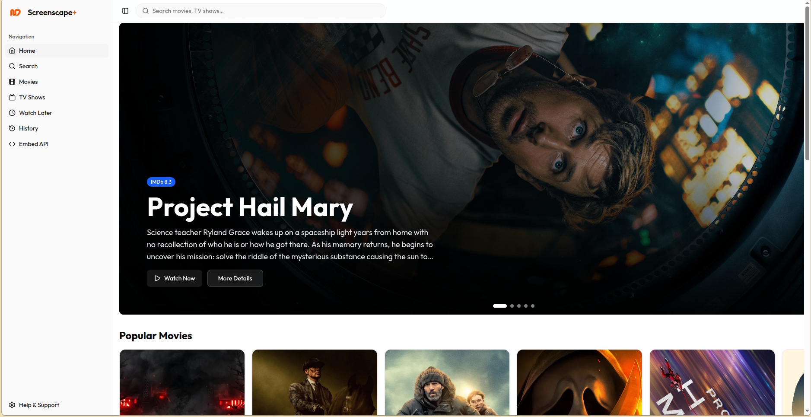<br/>
      <b>🌐 Web App</b><br/>
      <a href="https://screenscape.me/">screenscape.me</a><br/>
      <sub>Access from any browser</sub>
    </td>
    <td align="center" width="25%">
      <br/>
      <b>📱 Android App</b><br/>
      <a href="#installation">Download APK</a><br/>
      <sub>Full mobile experience</sub>
    </td>
    <td align="center" width="25%">
      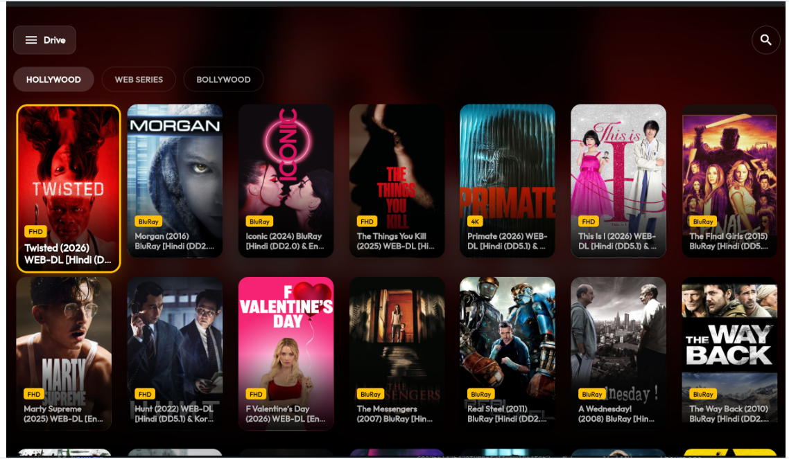<br/>
      <b>📺 TV App</b><br/>
      <a href="https://github.com/Anshu78780/screenscapetv/">GitHub Repo</a><br/>
      <sub>Big screen entertainment</sub>
    </td>
    <td align="center" width="25%">
      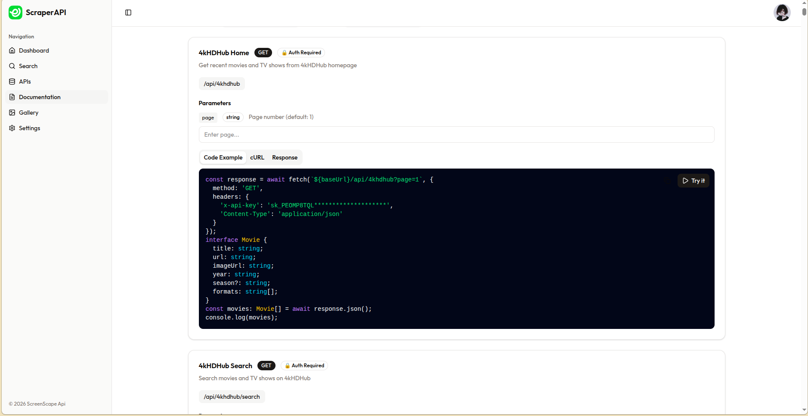<br/>
      <b>🔌 Developer API</b><br/>
      <a href="https://screenscapeapi.dev/">screenscapeapi.dev</a><br/>
      <sub>Build your own apps</sub>
    </td>
  </tr>
</table>

---

## ✨ Features

<table>
  <tr>
    <td width="50%">

### 🎬 Extensive Content Library
- Access thousands of movies, TV shows, anime, and live sports
- Multiple content providers with region-specific options
- Global, Indian, and specialized international content
- Regular updates with latest releases

### 🔍 Powerful Search & Discovery
- Find content across all providers instantly
- Filter by genres, years, and categories
- IMDB integration for ratings and metadata
- Smart recommendations based on preferences

### 📥 Download Manager *(Android)*
- Download content for offline viewing
- Smart organization of downloaded files
- Background download processing
- Multiple quality options

### ▶️ Advanced Video Player
- Support for multiple video formats
- Adjustable playback speed (0.5x - 2x)
- Custom subtitle support with sync
- Picture-in-picture mode
- Resume watching feature

    </td>
    <td width="50%">

### 🔄 Multi-Provider System
- Switch between content providers seamlessly
- Region-specific providers for localized content
- Automatic provider recommendations
- Fallback options for reliability

### � Multi-Device Support
- **Web**: Stream from any browser
- **Android**: Full mobile experience with downloads
- **TV**: Optimized for big screen viewing
- **API**: Build your own integrations

### 🛠️ Customization Options
- Personalize app appearance with themes
- Configure default playback settings
- Manage storage and quality preferences
- External player support

### 📋 Watchlist & History
- Keep track of what you want to watch
- Resume from where you left off
- Sync across devices *(coming soon)*
- Track your watching history

    </td>
  </tr>
</table>

---

## 📸 Screenshots

<div align="center">

### 🏠 Home Screen
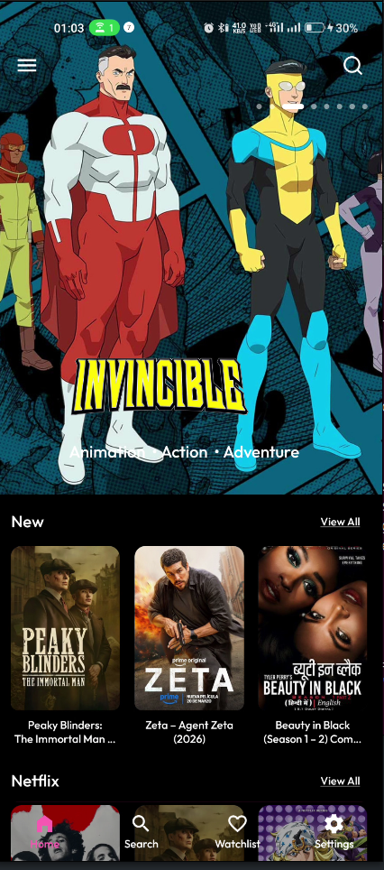

*Browse trending content and personalized recommendations*

---

### 🔍 Search & Discovery
<table>
  <tr>
    <td align="center">
      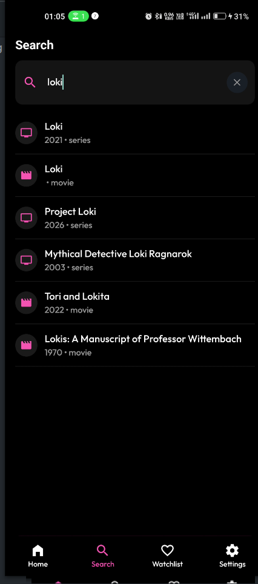<br/>
      <sub><b>Powerful Search</b></sub>
    </td>
    <td align="center">
      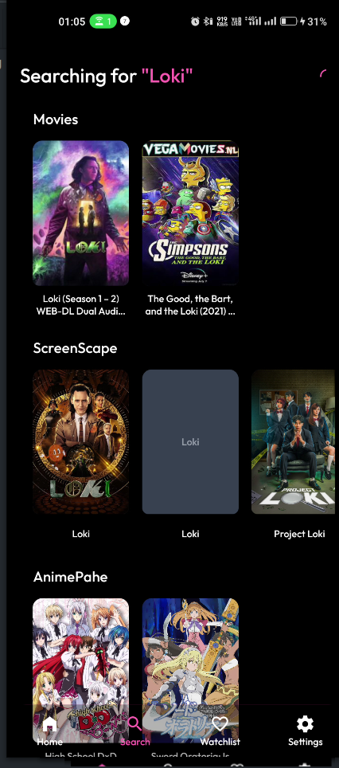<br/>
      <sub><b>Instant Results</b></sub>
    </td>
  </tr>
</table>

---

### 📺 Content & Playback
<table>
  <tr>
    <td align="center">
      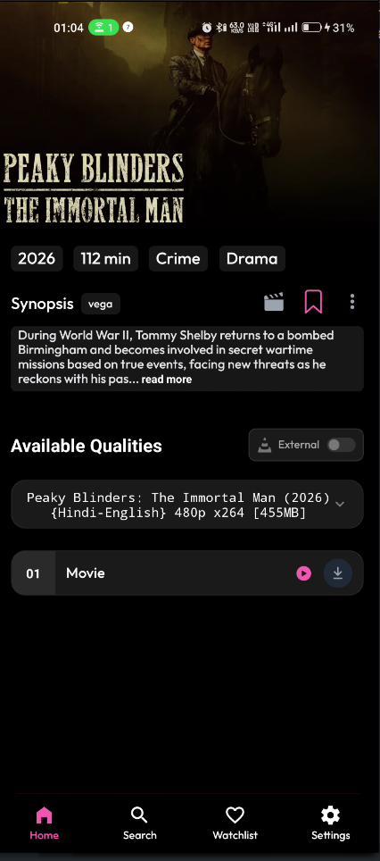<br/>
      <sub><b>Detailed Information</b></sub>
    </td>
    <td align="center">
      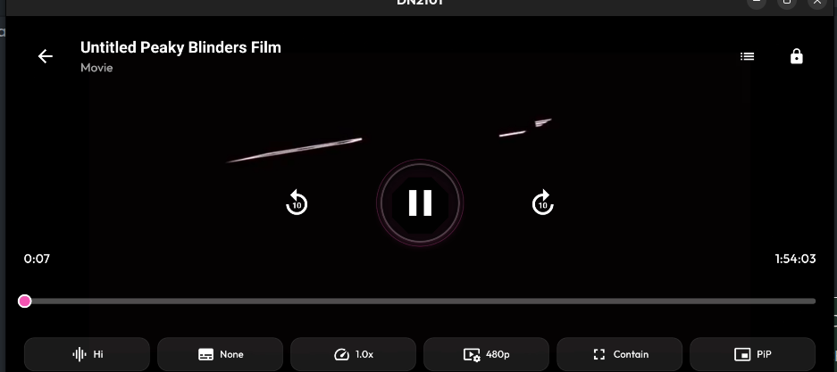<br/>
      <sub><b>Advanced Player</b></sub>
    </td>
  </tr>
</table>

---

### ⚙️ Settings & Providers
<table>
  <tr>
    <td align="center">
      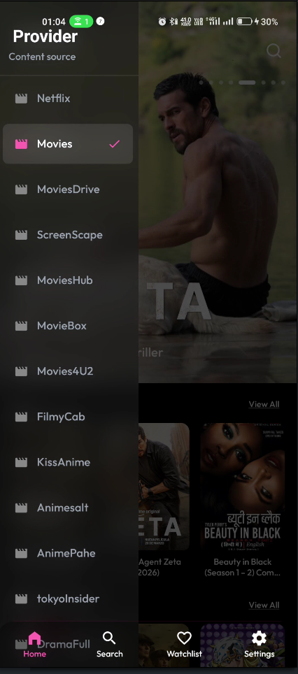<br/>
      <sub><b>Multiple Providers</b></sub>
    </td>
    <td align="center">
      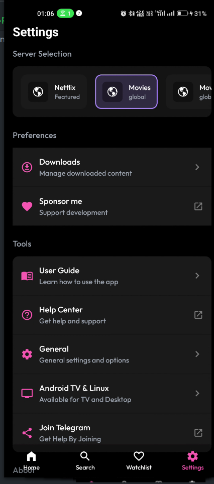<br/>
      <sub><b>Customization Options</b></sub>
    </td>
  </tr>
</table>

---

### 📥 Downloads & Quality
<table>
  <tr>
    <td align="center">
      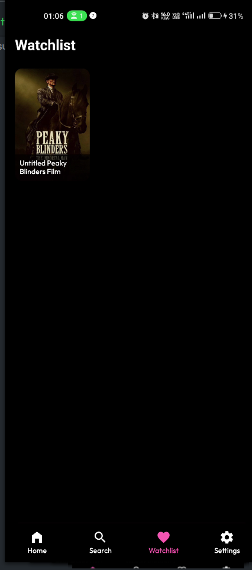<br/>
      <sub><b>Watchlist Management</b></sub>
    </td>
    <td align="center">
      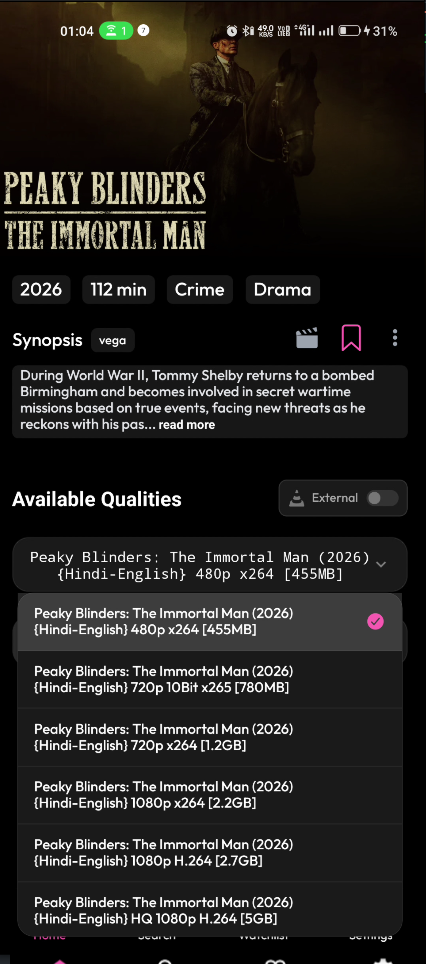<br/>
      <sub><b>Quality Options</b></sub>
    </td>
  </tr>
</table>

</div>

---

## 📱 Installation

### Android App

1. **Download** the latest APK from the [Releases](https://github.com/YourUsername/App-release/releases) section
2. **Enable** "Install from Unknown Sources" in your device settings
   - Go to Settings → Security → Unknown Sources
3. **Install** the downloaded APK file
4. **Launch** ScreenScape and start exploring

### Web App

Simply visit [**screenscape.me**](https://screenscape.me/) from any modern web browser. No installation required!

### TV App

1. Visit the [**TV App Repository**](https://github.com/Anshu78780/screenscapetv/)
2. Follow the installation instructions for your TV platform
3. Enjoy ScreenScape on the big screen

---

## 🔌 API Integration

ScreenScape provides a powerful API for developers to integrate our content discovery features into their own applications.

### API Features

- 🎬 Search movies, TV shows, anime, and sports
- 📊 Get detailed content information and metadata
- 🔗 Access streaming links from multiple providers
- 🌍 Region-specific content filtering
- ⚡ Fast and reliable responses

### Getting Started

Visit [**screenscapeapi.dev**](https://screenscapeapi.dev/) for:
- Complete API documentation
- Authentication guides
- Code examples and SDKs
- Rate limits and usage policies
- Developer support

### Quick Example

```javascript
// Example API call
fetch('https://screenscapeapi.dev/api/search?query=inception')
  .then(response => response.json())
  .then(data => console.log(data));
```

---

## 🎯 Recommended Providers

For the best experience, we recommend these providers:

| Provider | Best For | Quality | Speed |
|----------|----------|---------|-------|
| **Netflix Mirror** | Latest movies & TV shows | ⭐⭐⭐⭐⭐ | Fast |
| **MoviesDrive** | High-quality downloads | ⭐⭐⭐⭐⭐ | Medium |
| **MultiStream** | Diverse content library | ⭐⭐⭐⭐ | Fast |
| **ProtonMovies** | Streaming & downloads | ⭐⭐⭐⭐ | Fast |
| **FlixHQ** | English content | ⭐⭐⭐⭐⭐ | Very Fast |

> 💡 **Tip**: Different providers work better for different types of content and regions. Experiment to find what works best for you!

---

## 💡 Usage Tips

<details>
<summary><b>📥 Downloading Content (Android App)</b></summary>

1. Navigate to the content you want to download
2. Select your preferred quality (480p, 720p, 1080p)
3. Tap the download button
4. Monitor progress in the Downloads section
5. Access downloaded content offline anytime

</details>

<details>
<summary><b>🎮 External Player Support</b></summary>

1. Open content details page
2. Enable "External Player" mode
3. Select your preferred server
4. Choose your external player (VLC, MX Player, etc.)
5. Enjoy enhanced playback features

</details>

<details>
<summary><b>📝 Subtitle Management</b></summary>

1. During playback, tap the screen to show controls
2. Tap the subtitle icon (CC)
3. Select from available subtitles
4. Or add external subtitle files (.srt, .vtt)
5. Adjust subtitle timing if needed

</details>

<details>
<summary><b>📺 Casting to TV</b></summary>

1. Ensure your TV and device are on the same Wi-Fi network
2. Tap the cast icon during playback
3. Select your Chromecast or Smart TV
4. Control playback from your mobile device
5. Enjoy on the big screen

</details>

<details>
<summary><b>🔄 Switching Providers</b></summary>

1. Go to Settings → Providers
2. Browse available content providers
3. Select your preferred provider
4. The app will remember your choice
5. Switch anytime if a provider isn't working

</details>

---

## ❓ FAQ

<details>
<summary><b>Is ScreenScape free to use?</b></summary>

Yes! ScreenScape is completely free across all platforms (Web, Android, TV) with no hidden fees, subscriptions, or in-app purchases.

</details>

<details>
<summary><b>Do I need to create an account?</b></summary>

No account creation or login is required. Just download/visit and start watching immediately.

</details>

<details>
<summary><b>Why does a provider sometimes not work?</b></summary>

Content providers may be temporarily unavailable due to maintenance or regional restrictions. Simply switch to an alternative provider or try again later.

</details>

<details>
<summary><b>Can I use ScreenScape on multiple devices?</b></summary>

Absolutely! Use the web app on your computer, Android app on your phone, and TV app on your television. Your experience is seamless across all platforms.

</details>

<details>
<summary><b>How do I report bugs or request features?</b></summary>

Submit bugs and feature requests through our [GitHub Issues](https://github.com/YourUsername/App-release/issues) page. We actively monitor and respond to all submissions.

</details>

<details>
<summary><b>Is my data private and secure?</b></summary>

Yes! ScreenScape doesn't collect personal data. All viewing history, watchlists, and preferences are stored locally on your device.

</details>

<details>
<summary><b>Can I use the API for commercial projects?</b></summary>

Please visit [screenscapeapi.dev](https://screenscapeapi.dev/) for detailed information about API usage terms, rate limits, and commercial licensing.

</details>

<details>
<summary><b>Which platform should I use?</b></summary>

- **Web App**: Best for desktop/laptop browsing
- **Android App**: Full features including downloads
- **TV App**: Optimized for big screen viewing
- **API**: For developers building custom applications

</details>

---

## ⚠️ Disclaimer

ScreenScape operates as a content discovery and aggregation platform. We want to be transparent about how our service works:

- 📡 **No Content Hosting**: ScreenScape does not host, store, or distribute any media content on our servers
- 🔍 **Search & Indexing**: We function as a search engine that aggregates publicly available information from various third-party services
- 🌐 **Web Scraping Tool**: The platform indexes and organizes content information that is already publicly accessible on the internet
- 👤 **User Responsibility**: Users are responsible for ensuring they have the right to access content through their local networks and services
- 🚫 **No Liability**: ScreenScape is not responsible for how users utilize the discovered content or the availability of third-party services

By using ScreenScape, you acknowledge that you understand and accept these terms.

---

## 🤝 Contributing

We welcome contributions from the community! Here's how you can help:

- 🐛 Report bugs and issues
- 💡 Suggest new features
- 📝 Improve documentation
- 🌍 Help with translations
- ⭐ Star the repository if you find it useful

---

## 📞 Support & Community

- 🌐 **Website**: [screenscape.me](https://screenscape.me/)
- 🔌 **API Docs**: [screenscapeapi.dev](https://screenscapeapi.dev/)
- 📺 **TV App**: [GitHub Repository](https://github.com/Anshu78780/screenscapetv/)
- 🐛 **Issues**: [Report Bugs](https://github.com/YourUsername/App-release/issues)
- 💬 **Discussions**: [Join the Community](https://github.com/YourUsername/App-release/discussions)

---

## 📜 License

This project is licensed under the MIT License - see the [LICENSE](LICENSE) file for details.

---

<div align="center">

### Made with ❤️ for Entertainment Enthusiasts Worldwide

**ScreenScape** - *Your Gateway to Unlimited Entertainment*

[⬆ Back to Top](#-screenscape)

---


**Download Now** | **Visit Web App** | **Explore API** | **Get TV App**

[](https://screenscape.me/)
[](https://screenscapeapi.dev/)
[](https://github.com/Anshu78780/screenscapetv/)

</div>

